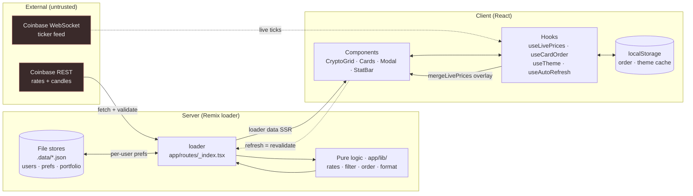

# CryptoTracker — Live Crypto Dashboard

A production-grade cryptocurrency trading dashboard built with **Remix + React +
TypeScript**. Live Coinbase rates render in a responsive card grid with **24h
sparklines**, **change %**, and a **live market stat bar** — all filterable,
drag-and-drop reorderable, and themable (dark/light).

 

## Design

"**Midnight Terminal**" — a luxe fintech aesthetic: a near-black canvas with a
layered gradient-mesh + grain atmosphere, a warm **gold** accent, and
**emerald/rose** for price movement. Type is **Clash Display** (headlines) +
**Satoshi** (UI) + **JetBrains Mono** (tabular figures). Signature touches:
dependency-free SVG sparklines, **price-flash** tinting on every refresh,
staggered card-reveal on load, and a glassy panel system. The whole theme is
driven by CSS variables, so dark/light is a single token swap.

---

## Features

✅ = core requirement · ➕ = enhancement beyond the brief.

- **Live data** ✅➕ — 12 coins in a responsive 1→4 column grid; USD + BTC rates
  from one Coinbase call (adaptive precision); 24h sparkline + change % from real
  candles (best-effort); live market stat bar (avg 24h, top gainer/loser).
- **Real-time** ➕ — client WebSocket to Coinbase's public ticker (no backend),
  with polling fallback; rolling-digit prices, scrolling ticker tape, price-flash.
- **Interaction** ✅ — filter by name/symbol (URL `?q=`), drag-and-drop reorder
  (pointer **and** keyboard, persisted by symbol), manual + auto refresh (30s,
  pauses on hidden tab).
- **Detail & motion** ➕ — click a card for a live interactive chart modal with
  hover-to-inspect; spring layout/reorder, 3D card tilt, top-movers spotlight.
- **Personalization** ➕ — 9 full themes (palette + fonts + background + cards),
  SSR-safe dark/light with no flash, accent/density/layout panel — all persisted.
- **Accounts** ✅➕ — cookie-session auth (scrypt-hashed, no deps); universal
  search to track *any* Coinbase coin, per-user watchlist, and `/portfolio` P/L
  simulation; preferences persist **server-side per account** across devices.
- **Quality** ✅➕ — loading/error/empty states with retry; **153 unit tests**
  (Vitest) + Playwright E2E (mock mode, zero live calls); structured JSON
  observability (request ids, timing, metrics).

---

## Setup

**Requirements:** Node.js ≥ 20.

```bash
npm install        # installs from the public npm registry (see note below)
npm run dev        # start dev server → http://localhost:3000
```

Other scripts:

```bash
npm run build      # production build
npm start          # serve the production build
npm run typecheck  # tsc --noEmit (strict)
npm test           # run unit tests once (Vitest)
npm run test:watch # watch mode
npm run test:e2e   # Playwright E2E (builds + serves in mock mode, no live calls)
npm run heal       # gate + dependency/security report (no changes)
```

> **Registry note:** this project ships a local `.npmrc` pinning installs to
> `https://registry.npmjs.org/`. It was developed on a machine whose global npm
> pointed at a private registry; the local file keeps `npm install` portable
> without touching your global config. Delete it if you don't need it.

### Auth & env
- Set **`AUTH_SECRET`** to a strong random string in any real deployment (used to
  sign the session cookie). A dev fallback is used otherwise.
- No Coinbase API key is needed — the public endpoints are unauthenticated.

## Testing

### Unit tests (Vitest)
Pure logic (`app/lib/`) is covered by fast, deterministic unit tests:

```bash
npm test            # run once
npm run test:watch  # watch mode
```

### End-to-end tests (Playwright)
E2E specs in `e2e/` cover the real user flows — auth, search-and-track,
watchlist, remove-coin, the detail modal, theme/dark-light persistence, and the
live toggle.

```bash
npx playwright install chromium   # one-time: install the browser binary
npm run test:e2e                  # builds + serves itself; runs all specs
npm run test:e2e -- --ui          # interactive debug mode
```

The suite runs with **`E2E_MOCK=1`** (set only by `playwright.config.ts`), so the
loader serves deterministic fixtures (`coinbase-mock.ts`) and the WebSocket stays
off — **zero external calls**, safe for CI and offline machines. A normal
`dev`/`start` never sets it. It runs **serially** (one worker) because the
file-backed user/prefs store isn't concurrent-write-safe.

### Observability
Server logs are structured JSON (`app/lib/observability/`). Control verbosity
with **`LOG_LEVEL`** (`debug|info|warn|error`) and pretty local output with
**`LOG_PRETTY=1`**. Loaders/actions attach a request id, time the Coinbase fetch,
and increment counters; see `app/lib/observability/README.md`.

---

## How it works

### Architecture at a glance



**Read it as two I/O boundaries** — the server `loader` (REST, SSR, source of
truth) and the client WebSocket (live ticks that *augment* loader data, never
replace it). Everything between is pure `app/lib/` logic (testable) and
presentational components. If the socket drops, polling the loader still renders
a complete UI; if a coin's candles fail, only its sparkline drops.

### Data flow — prices in one call, trends in parallel
Coinbase's `GET /v2/exchange-rates?currency=USD` returns a single map of
"units per 1 USD" for every currency. Both required price columns are derived
from that **one** response with pure functions (`app/lib/rates.ts`):

```
USD price of X = 1 / rates[X]
BTC price of X = rates[BTC] / rates[X]
```

The 24h **sparkline + change %** come from Coinbase Exchange candle data
(`/products/{X}-USD/candles`), fetched **in parallel** alongside the rate table
and treated as **best-effort**: if a coin's candles fail, that card simply
renders without a sparkline rather than failing the page. The required data is
still a single call; the trend data is an enhancement that degrades gracefully.

### Real-time: hybrid loader + WebSocket
Initial render and sparkline history come from the server `loader` (good SSR,
one REST call). **Live prices stream over a client-side WebSocket directly to
Coinbase's public feed** (`wss://ws-feed.exchange.coinbase.com`, `ticker`
channel) — no custom backend, because the feed is public and unauthenticated. A
backend proxy would only earn its keep for hiding a key or multi-client fan-out,
neither of which applies here.

- `useLivePrices` opens the socket (browser-only, SSR-safe), with
  exponential-backoff reconnect and tab-visibility pause.
- `mergeLivePrices` (pure) overlays live USD prices onto loader rows, recomputing
  BTC price and 24h change from each tick's `open_24h`. Sparklines keep using
  loader candle history. The `LiveBadge` shows feed status.
- **Polling is the fallback:** `useAutoRefresh` auto-revalidates the loader *only
  when the WebSocket isn't live*. When live, polling stays idle. Manual refresh
  and the auto toggle still re-run the loader (refreshing candle history).
- Errors thrown in the loader drive a route `ErrorBoundary` with retry.

### Rate-limit safety (fixes "refresh fails when clicked fast")
Each loader run does 1 rate-table call + N candle calls. To avoid tripping
Coinbase's ~10 req/s/IP limit on rapid refreshes: candle results are held in a
short-TTL cache (`lib/ttl-cache.ts`) so bursts reuse them, and the required
rate-table call retries once on a `429` before surfacing an error.

### State ownership
| State | Where | Why |
|---|---|---|
| Initial rates + candles | Remix loader | Server-fetched (SSR), revalidated on refresh; cached to dodge rate limits |
| Live price ticks | `useLivePrices` (WebSocket) | Sub-second updates, merged over loader data; polling fallback when down |
| Filter text | URL `?q=` | Shareable, survives reload, no extra state lib |
| Card order | `useCardOrder` + localStorage | Persists across reloads; keyed by **symbol** so it survives coins being added/removed |
| Theme | `useTheme` + localStorage | Blocking inline script applies it pre-paint (no flash) |
| Personalization | `useSettings` + localStorage | Accent/density/layout/toggles/coins; accent applied via CSS vars; read by leaf components through `SettingsProvider` |

### Accessibility
Drag-and-drop works with both pointer and keyboard (dnd-kit sensors). The drag
handle is a labeled button; filter results are announced via an `aria-live`
region. Dragging is intentionally disabled while a filter is active, because a
filtered subset doesn't map cleanly onto the persisted full-list order.

---

## Project structure

```
app/
  root.tsx               # HTML shell, Tailwind, pre-paint theme bootstrap
  routes/_index.tsx      # loader (Coinbase fetch) + dashboard + ErrorBoundary
  tailwind.css           # design system: fonts, CSS-var palette, animations
  components/             # presentational + dnd wrappers (no data logic)
    CryptoCard · SortableCryptoCard · CryptoGrid · LiveBadge · TickerTape
    Sparkline · InteractiveChart · CoinDetailModal · RollingNumber
    StatBar · FilterInput · RefreshControls · ThemeToggle · StateViews
  hooks/                  # useCardOrder, useAutoRefresh, useTheme, usePriceFlash,
                          #   useLivePrices, useTilt
  lib/                    # PURE logic: rates/snapshot, filter, ordering, format,
                          #   live-merge, ttl-cache, coinbase (REST) + coinbase-ws (WS wire)
  types/crypto.ts         # provider-agnostic domain types
  tests/                  # Vitest unit tests for the lib/ layer
```

The guiding principle: **all business logic lives in `app/lib/` as pure,
side-effect-free functions** (rate math, filtering, reorder). Components are
presentational; hooks bridge pure logic to React. This is what makes the logic
unit-testable and the codebase easy to extend — see
[`CLAUDE.md`](./CLAUDE.md) for step-by-step recipes (adding a coin, adding a sort
control, swapping the data provider).

---

## Decisions & tradeoffs

Each choice below names the **alternative** and what it **costs**, not just what
was picked — the point is to make the engineering judgement visible.

- **Pure logic in `app/lib/`, presentation in components.** Every rate
  calculation, filter, reorder, and formatter is a side-effect-free function with
  a unit test; components only render. **Win:** the hard-to-get-right math is
  testable in isolation and the UI is swappable. **Cost:** more files and a
  little ceremony moving values across the boundary — paid back the first time a
  number was wrong and the failing test pointed straight at the bug.

- **One data path: the Remix loader.** All fetching is server-side in the route
  loader; refresh = `revalidate`, never a second client fetch. **Win:** one
  source of truth, good SSR, no API surface in the browser. **Cost:** "just fetch
  it in the component" is off-limits, so live prices needed a deliberate second
  boundary (the WebSocket) rather than an ad-hoc `useEffect`.

- **Live prices augment, never depend.** The Coinbase WebSocket overlays ticks
  onto loader data via a pure `mergeLivePrices`; if the socket is down, polling
  the loader still renders a complete UI. **Win:** real-time when available,
  correct when not. **Cost:** two code paths for "current price" and the merge
  logic to reconcile them — accepted so a flaky socket can never blank the page.

- **Remix v2, not React Router 7.** The exercise specifies Remix, but
  `create-remix` now only redirects to RR7. **Cost:** scaffolded manually against
  the stable v2 Vite template and pinned to v2 — chosen over fighting the
  scaffolder or silently migrating off the brief.

- **Filter in the URL, order + prefs in storage.** Filter is ephemeral and
  shareable → `?q=`; order/theme are durable preferences → persisted. **Win:**
  shareable, reload-safe state with **no global store**. **Cost:** state lives in
  a few different places by nature, rather than one tidy store.

- **Hand-rolled SVG sparklines + chart, no charting library.** **Win:** zero
  dependency weight, fully on-theme, and the hover-crosshair is just pointer math.
  **Cost:** we maintain the line/area/scale code ourselves — cheap for a
  sparkline, and it keeps the bundle and the supply-chain surface small.

- **Motion (framer-motion) is the one animation dependency.** Added deliberately
  for spring layout and modal transitions CSS can't do cleanly. **Tradeoff:** one
  runtime dep accepted for genuine UX value; reduced-motion is honored throughout.

- **Cookie-session auth, not a JWT in localStorage.** A signed, `httpOnly`,
  `sameSite=lax` cookie holds only the user id; `requireUser` looks the user up
  server-side per request. Passwords are **scrypt-hashed with Node built-ins** (no
  bcrypt dep). **Win:** tokens aren't readable by page scripts (XSS-resistant).
  **Cost:** server lookup per request instead of a self-contained token —
  acceptable, and the right default for credentials.

- **Two-tier preference storage (server wins, localStorage caches).** Per-user
  prefs live server-side keyed by `userId` so they follow the account across
  devices; `localStorage` is a fast-path cache for flash-free first paint. **Win:**
  cross-device prefs *and* instant paint. **Cost:** real reconciliation work — a
  `userTouched` guard stops the async server hydrate from clobbering an early
  interaction, and a `sendBeacon` page-hide flush stops a change-then-reload from
  losing data to the save debounce.

- **"Tracked" and "watchlist" are separate concepts.** Tracking = which coins are
  fetched/priced/streamed; watchlist = a favorites *view* over them. **Why it
  matters:** conflating them caused the early "added coin disappears" bug — the
  split is the fix, at the cost of two ideas to keep straight.

- **Themes are full palettes, not an accent swap.** Each of the 9 themes redefines
  colours, fonts, card shape, and background via a `data-theme` + `data-mode`
  contract in `tailwind.css`. **Cost:** more design tokens to maintain than a
  single dark/light pair — the price of themes that feel genuinely distinct rather
  than recoloured.

- **Mock-data mode (`E2E_MOCK=1`) for zero-network runs.** Deterministic fixtures
  let the whole app (and Playwright) run with **no external calls**. **Win:** fast,
  deterministic, CI- and offline-safe tests. **Cost:** a fixture set to keep
  roughly in step with the real API shape.

- **File-backed JSON stores (`.data/*.json`).** Dependency-free persistence for
  users, prefs, and portfolios. **Cost:** not concurrent-write-safe and won't
  scale — deliberately fine for a demo, and each store is isolated behind a module
  so swapping in a real database touches one file (see below).

## Where we can extend this

The architecture was built to make these additions small, isolated changes — not
rewrites. Each maps to a seam that already exists:

- **Swap the data provider.** Only `coinbase.ts` (REST) and `coinbase-ws.ts` (WS
  wire format) know provider shapes; everything downstream is provider-agnostic.
  Reimplement those two and the UI, types, and tests are untouched.
- **Move to a real database.** The file-backed stores already isolate persistence
  behind a module each, so SQLite/Postgres swaps in behind the same interface
  without touching routes or components.
- **Add sort controls (by price / 24h change).** The pure `lib/` layer is shaped
  for it — add a `sortCryptos` function + test, store the active sort in the URL
  like the filter, and disable drag while a sort is active (the recipe is in
  [`CLAUDE.md`](./CLAUDE.md)).
- **Add a new card field or coin.** A field is a 3-step change (add to the type,
  populate it in `buildRates` with a test, then format and render); a coin is a
  single entry in `TRACKED_CURRENCIES`. Both are documented recipes in `CLAUDE.md`.
- **Harden the server.** Add rate-limit/backoff handling and a
  stale-while-revalidate cache around the loader's Coinbase calls — the
  short-TTL candle cache is already the hook to build on.
- **Broaden test coverage.** Extend E2E to portfolio P&L and per-theme effects,
  and add visual-regression snapshots over the themes.
